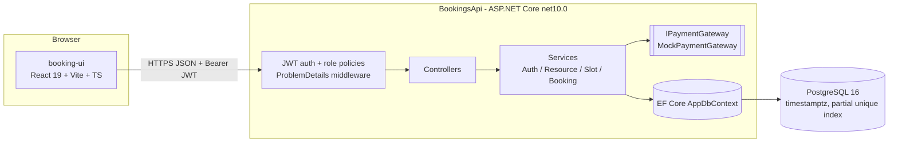

# Architecture — Booking System

Source of truth: `PRD.md`. This doc adds no scope; it explains how the PRD pieces fit and why.

## 1. Components



One API process, one database. `IPaymentGateway` is the only abstraction (mock: succeeds unless card token is `fail`).

## 2. Request flows

**Register / login.** Client POSTs `/api/auth/register` (email, password, name, role in {Customer, Provider}). Service lowercases/trims email, hashes with `PasswordHasher<User>` (PBKDF2), inserts the user; unique-email violation (23505) maps to 409. Returns 201 `{token,user}`. Login looks up by email, verifies the hash, and returns the same shape; bad credentials give 401 with a generic message (no user enumeration). The JWT carries `sub` (user id), `role`, and a short expiry. The UI stores it in memory plus localStorage and sends it on every call.

**Book with payment (POST /api/bookings, `Idempotency-Key`).**
1. Validate the key header (required, else 400) and the body. Role must be Customer.
2. Look up `(CustomerId, IdempotencyKey)`. If found, return the original booking (same status code semantics: 201 with the stored result; if it ended `PaymentFailed`, return the same 402). No second charge.
3. Load the slot: 404 if missing; 409 if `StartUtc <= now`; 403/409 if the slot's resource belongs to the caller (own-provider rule, effectively impossible for a Customer-role account, kept as a guard).
4. INSERT booking `Pending` (amount = slot price) and commit. This claims the slot via the partial unique index. Violation of the slot index (23505) means another active booking exists: 409. Violation of the idempotency index means a concurrent duplicate request: reload and return the original.
5. Call `IPaymentGateway.ChargeAsync(amountCents, cardToken, bookingId)` **after** the claim commit and outside any open DB transaction.
6. Success: UPDATE status `Confirmed`, set `PaymentRef`, `UpdatedAt`; return 201.
7. Failure (declined or exception/timeout): UPDATE status `PaymentFailed` (leaves the partial index, so the slot is released); return 402 ProblemDetails.
8. Crash between 4 and 6 leaves a stale `Pending` (accepted MVP gap; see section 8).

**Cancel (POST /api/bookings/{id}/cancel).** Load by id AND `CustomerId = caller`; not found or not owned gives 404. Status must be `Confirmed` and slot start in the future, else 409. Conditional update (`WHERE Id=@id AND Status='Confirmed'`) sets `Cancelled`; zero rows affected gives 409, which makes double-cancel safe under races. Mock refund is a log line. Slot is free again via the index predicate.

**Reschedule (POST /api/bookings/{id}/reschedule, `{newSlotId}`).** One DB transaction:
1. Load own booking (404 if not owned); must be `Confirmed` and its slot in the future, else 409.
2. Load the new slot: same `ResourceId` as the old one (else 400), future, different from current.
3. Within the transaction: set old booking `Cancelled` (conditional on `Confirmed`), then insert the new `Confirmed` booking for the new slot. Order matters for nothing in the index (different slots), but both writes commit or neither does.
4. Unique violation on the new slot gives rollback and 409; the original booking is untouched.
5. No payment call in MVP (price difference ignored), so no external side effect can sit inside the transaction. Returns 200 with the new booking.

Note: the PRD says "returns 200 booking". The response is the new booking; the old one shows as `Cancelled` in "my bookings". See flaw list.

## 3. Concurrency and consistency

- **No overbooking** is guaranteed by `CREATE UNIQUE INDEX ... ON "Bookings"("SlotId") WHERE "Status" IN ('Pending','Confirmed')`. App-level pre-checks are only for friendly errors; the index is the arbiter. N parallel requests: one insert wins, the rest get 23505 and 409.
- **Pending-first**: the slot is claimed (committed) before charging, so we never charge without holding the slot. A failed charge flips to `PaymentFailed`, releasing the slot. Payment is never called inside a DB transaction (no held locks or connections during network I/O).
- **Idempotency**: unique `(CustomerId, IdempotencyKey)`; replay returns the stored outcome. Racing duplicates are resolved by the same index.
- **State changes** use conditional updates (`WHERE Status = expected`) so cancel/confirm cannot overwrite each other.
- **Slot overlap** (F3): checked and inserted in one transaction. A plain pre-check races, so for correctness use either a Postgres exclusion constraint (`EXCLUDE USING gist (ResourceId WITH =, tstzrange(StartUtc, EndUtc) WITH &&)` with `btree_gist`) or a `SERIALIZABLE`/advisory-lock transaction keyed on ResourceId. Recommended: take `pg_advisory_xact_lock(ResourceId)` then check-and-insert; the exclusion constraint is the stricter option if time allows. The PRD does not mandate a DB constraint here, so the advisory-lock path is the MVP choice.
- **Slot delete** (F3): `DELETE ... WHERE Id=@id AND NOT EXISTS (active booking)`; FK from Bookings to Slots is `Restrict`, so a race with a new booking fails with an FK/409 rather than orphaning data. Deleting a slot with only historical (Cancelled/PaymentFailed) bookings is blocked by the FK too; see flaw list.
- **Time**: all instants are UTC `DateTime` (Kind=Utc) or `DateTimeOffset` with zero offset; API inputs are normalized/rejected if not UTC-convertible; "now" comes from `TimeProvider`/`DateTime.UtcNow` once per request.

## 4. Auth and authorization

- JWT bearer (HMAC-SHA256, key from config, issuer/audience/lifetime validated, clock skew small). Claims: `sub`, `email`, `role`.
- Fallback policy: authenticated user required; `[AllowAnonymous]` only on register/login.
- Role gating: `[Authorize(Roles="Provider")]` on `/api/provider/*`; `[Authorize(Roles="Customer")]` on `/api/bookings*`; browse endpoints accept any authenticated role. Wrong role gives 403.
- Ownership (the real hole to guard): provider endpoints resolve the resource via `Resource.ProviderId == callerId`; bookings via `CustomerId == callerId`. Non-owned ids return 404 (no existence leakage). The caller id always comes from the token, never from the request body. Role in register is user-chosen (no admin role exists, so self-selected Provider is acceptable).

## 5. Error model

All errors are RFC 7807 `ProblemDetails` (`type`, `title`, `status`, `detail`, optional `errors` for validation) via `AddProblemDetails` plus an exception-handling middleware and `ApiBehaviorOptions` for model validation.

| Status | When |
|---|---|
| 400 | Validation, missing Idempotency-Key, cross-resource reschedule |
| 401 | Missing/invalid token, bad credentials |
| 402 | Payment declined or gateway error on booking |
| 403 | Wrong role |
| 404 | Not found or not owned |
| 409 | Slot taken, overlap, slot booked (delete), cancel/reschedule invalid state, duplicate email |
| 500 | Unhandled; generic detail, logged with trace id |

Domain failures are raised as a small exception type (or result) carrying a status; the middleware maps them and Postgres `23505` to 409. The UI shows `detail` for 402/409 verbatim.

## 6. Project layout

```
BookingsApi/
  Program.cs                 DI, JWT, CORS, ProblemDetails, Migrate on startup (dev)
  appsettings(.Development).json
  Controllers/               AuthController, ResourcesController, ProviderController, BookingsController
  Services/                  AuthService, ResourceService, SlotService, BookingService
  Payments/                  IPaymentGateway, MockPaymentGateway
  Data/                      AppDbContext, Migrations/
  Domain/                    User, Resource, Slot, Booking, enums (Role, BookingStatus)
  Dtos/                      request/response records
  Infrastructure/            ErrorHandling middleware, current-user helper
BookingsApi.Tests/           parallel-booking, payment-failure, reschedule-conflict, auth tests
docker-compose.yml           Postgres 16 (service db)
booking-ui/
  src/
    api/                     fetch wrapper (adds token, parses ProblemDetails), typed endpoints
    auth/                    AuthContext, RequireRole route guard
    pages/                   Login, Register, Resources, SlotPicker, MyBookings,
                             provider/ MyResources, ManageSlots, ProviderBookings
    components/              Layout, ErrorBanner
    App.tsx, main.tsx        router
```

## 7. Scale-up path (README-level only)

Target 10M users, ~1M bookings/day (~12/s avg, ~100/s peak): a single well-indexed Postgres handles it as is. Growth steps, in order:
1. **Read replicas** for browse/slot search and "my bookings"; writes stay on primary.
2. **Slot cache** (Redis, short TTL, invalidated on book/cancel) for hot resource slot lists; the DB index remains the source of truth, so a stale cache can only cause a 409, never an overbook.
3. **Payment queue**: Pending is claimed synchronously, charging moves to a worker; client polls or gets pushed the result. Idempotency keys pass through to the real provider.
4. **Sweeper** job expires stale `Pending` rows (older than N minutes) to `PaymentFailed`/`Expired` after reconciling with the gateway.
5. **Partitioning**: range-partition `Bookings` (and `Slots`) by time; archive old partitions. Keep the partial unique index per partition by including the partition key only if slot start is the key (slots do not move across partitions); otherwise partition by hash of `SlotId`.
6. **Pagination** (`take/skip`, then keyset) on list endpoints; connection pooling (PgBouncer); stateless API behind a load balancer (JWT needs no shared session).

## 8. Decisions and trade-offs

| Decision | Why | Cost |
|---|---|---|
| DB partial unique index as the only overbooking guard | Correct under any concurrency or instance count | Postgres-specific syntax |
| Claim (Pending) then charge, two commits | No charge without slot; no network I/O in a transaction | Stale Pending on crash; sweeper deferred |
| Reschedule has no payment | Keeps it atomic in one local transaction | Price differences ignored (documented) |
| Reschedule creates a new booking and cancels the old | Fits "one active booking per slot" index and keeps history | Booking id changes |
| Controllers + thin services, no repository/MediatR | PRD forbids; EF is already the abstraction | Services touch DbContext directly |
| Single access token, no refresh | Out of scope | Re-login on expiry |
| 404 for non-owned resources | No existence leakage | Slightly less informative |
| Advisory lock for slot overlap | Simple, correct without extra extension | Per-resource serialization of slot creation (negligible) |

## 8a. Decisions closing PRD gaps

1. **Slot overlap is DB-guaranteed.** Overlap check and insert run in one transaction under `pg_advisory_xact_lock(ResourceId)`; a gist exclusion constraint (`btree_gist`, `tstzrange(StartUtc, EndUtc)`) is the preferred backstop if time allows. Violation maps to 409.
2. **Reschedule creates a new booking id.** The old booking becomes `Cancelled`; the response is the new `Confirmed` booking.
3. **Retry after a decline needs a new `Idempotency-Key`.** Replaying a key returns the stored outcome, including the same 402 for a `PaymentFailed` booking.
4. **Status values** are `Pending`, `Confirmed`, `PaymentFailed`, `Cancelled`, stored as strings (EF `HasConversion<string>()`), which is what the partial index filter relies on.
5. **Provider self-registration is intentional.** There is no admin role, so the role chosen at register is accepted.
6. **Slot delete** is blocked by a Restrict FK for any slot with any booking history (409); only never-booked slots can be deleted.

## 9. Index summary (supports the flows)

`Users(Email) UNIQUE`; `Resources(ProviderId)`; `Slots(ResourceId, StartUtc)`; `Bookings(SlotId) UNIQUE WHERE active`; `Bookings(CustomerId, IdempotencyKey) UNIQUE`; `Bookings(CustomerId, CreatedAt)`. Provider bookings view joins Bookings to Slots to Resources by `ProviderId`; the `SlotId` index covers it at MVP size.
