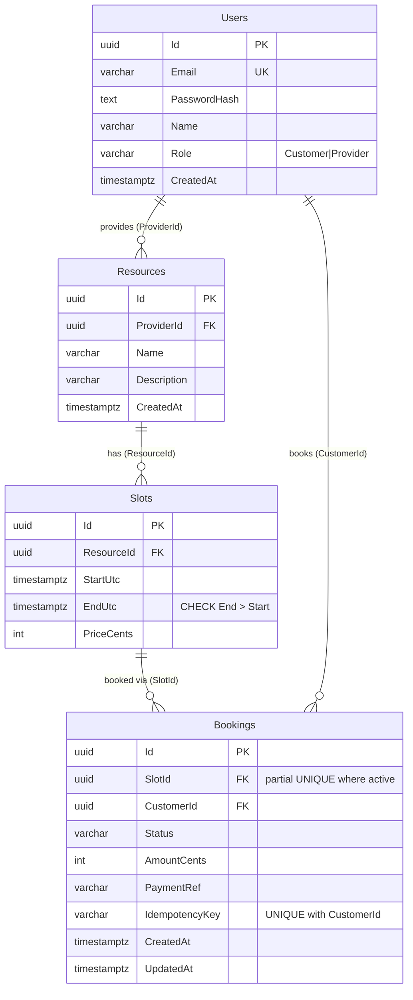
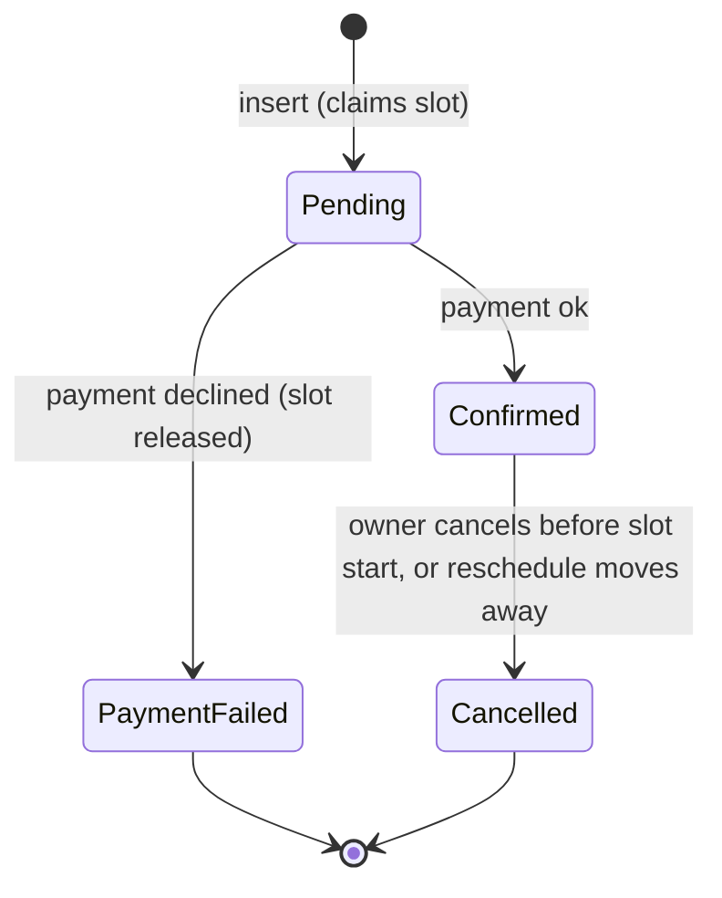

# Database schema (PostgreSQL 16)

Source: PRD section 4 and 6. The schema is created by EF Core migrations (`BookingsApi/Data/Migrations`, applied automatically on startup in Development); [`schema.sql`](schema.sql) is the equivalent reference DDL (identical to the block in section 2) and is no longer run by docker. `InitialCreate` also adds the `EX_Slots_NoOverlap` exclusion constraint via raw SQL; `SeedDemoData` loads fake demo users (`provider1@demo.test`, `provider2@demo.test`, `customer1..3@demo.test`, password `Passw0rd!`), resources, slots for the next 14 days and a few bookings.

## 1. ERD



## 2. DDL

```sql
-- Booking system schema, PostgreSQL 16. All times timestamptz (UTC), money in integer cents.
-- Identifiers are quoted PascalCase to match EF Core / Npgsql conventions.

CREATE EXTENSION IF NOT EXISTS btree_gist;

CREATE TABLE "Users" (
    "Id"           uuid         NOT NULL DEFAULT gen_random_uuid(),
    "Email"        varchar(256) NOT NULL,
    "PasswordHash" text         NOT NULL,
    "Name"         varchar(200) NOT NULL,
    "Role"         varchar(16)  NOT NULL,
    "CreatedAt"    timestamptz  NOT NULL DEFAULT now(),
    CONSTRAINT "PK_Users" PRIMARY KEY ("Id"),
    CONSTRAINT "CK_Users_Role" CHECK ("Role" IN ('Customer','Provider'))
);
CREATE UNIQUE INDEX "UX_Users_Email" ON "Users" ("Email");

CREATE TABLE "Resources" (
    "Id"          uuid         NOT NULL DEFAULT gen_random_uuid(),
    "ProviderId"  uuid         NOT NULL,
    "Name"        varchar(200) NOT NULL,
    "Description" varchar(2000),
    "CreatedAt"   timestamptz  NOT NULL DEFAULT now(),
    CONSTRAINT "PK_Resources" PRIMARY KEY ("Id"),
    CONSTRAINT "FK_Resources_Users_ProviderId" FOREIGN KEY ("ProviderId")
        REFERENCES "Users" ("Id") ON DELETE RESTRICT
);
CREATE INDEX "IX_Resources_ProviderId" ON "Resources" ("ProviderId");

CREATE TABLE "Slots" (
    "Id"         uuid        NOT NULL DEFAULT gen_random_uuid(),
    "ResourceId" uuid        NOT NULL,
    "StartUtc"   timestamptz NOT NULL,
    "EndUtc"     timestamptz NOT NULL,
    "PriceCents" integer     NOT NULL,
    CONSTRAINT "PK_Slots" PRIMARY KEY ("Id"),
    CONSTRAINT "FK_Slots_Resources_ResourceId" FOREIGN KEY ("ResourceId")
        REFERENCES "Resources" ("Id") ON DELETE RESTRICT,
    CONSTRAINT "CK_Slots_EndAfterStart" CHECK ("EndUtc" > "StartUtc"),
    CONSTRAINT "CK_Slots_Price" CHECK ("PriceCents" >= 0),
    -- No overlapping slots within a resource; half-open [start,end) so back-to-back slots are allowed.
    -- Violation: SqlState 23P01 (exclusion_violation) -> map to 409.
    CONSTRAINT "EX_Slots_NoOverlap" EXCLUDE USING gist
        ("ResourceId" WITH =, tstzrange("StartUtc", "EndUtc", '[)') WITH &&)
);
CREATE INDEX "IX_Slots_ResourceId_StartUtc" ON "Slots" ("ResourceId", "StartUtc");

CREATE TABLE "Bookings" (
    "Id"             uuid         NOT NULL DEFAULT gen_random_uuid(),
    "SlotId"         uuid         NOT NULL,
    "CustomerId"     uuid         NOT NULL,
    "Status"         varchar(16)  NOT NULL,
    "AmountCents"    integer      NOT NULL,
    "PaymentRef"     varchar(100),
    "IdempotencyKey" varchar(100) NOT NULL,
    "CreatedAt"      timestamptz  NOT NULL DEFAULT now(),
    "UpdatedAt"      timestamptz  NOT NULL DEFAULT now(),
    CONSTRAINT "PK_Bookings" PRIMARY KEY ("Id"),
    CONSTRAINT "FK_Bookings_Slots_SlotId" FOREIGN KEY ("SlotId")
        REFERENCES "Slots" ("Id") ON DELETE RESTRICT,
    CONSTRAINT "FK_Bookings_Users_CustomerId" FOREIGN KEY ("CustomerId")
        REFERENCES "Users" ("Id") ON DELETE RESTRICT,
    CONSTRAINT "CK_Bookings_Status" CHECK ("Status" IN ('Pending','Confirmed','PaymentFailed','Cancelled')),
    CONSTRAINT "CK_Bookings_Amount" CHECK ("AmountCents" >= 0)
);

-- No-overbooking guarantee: at most one active booking per slot. Violation: SqlState 23505 -> 409.
CREATE UNIQUE INDEX "UX_Bookings_SlotId_Active" ON "Bookings" ("SlotId")
    WHERE "Status" IN ('Pending','Confirmed');

-- Idempotency (violation 23505 -> load and return the original booking).
CREATE UNIQUE INDEX "UX_Bookings_CustomerId_IdempotencyKey" ON "Bookings" ("CustomerId", "IdempotencyKey");

-- "My bookings", newest first.
CREATE INDEX "IX_Bookings_CustomerId_CreatedAt" ON "Bookings" ("CustomerId", "CreatedAt" DESC);

-- Optional (not in PRD): speeds FK check on slot delete and provider-bookings join across all statuses.
-- CREATE INDEX "IX_Bookings_SlotId" ON "Bookings" ("SlotId");
```

Status is stored as text (`varchar`) with a CHECK limiting it to Pending, Confirmed, PaymentFailed, Cancelled (EF: `HasConversion<string>()`). Conventions: `uuid` PKs (`gen_random_uuid()` is built in since PG13), `varchar` + CHECK for enums (EF stores enums as strings), all FKs `ON DELETE RESTRICT`, `timestamptz` for every time (Npgsql requires UTC values).

## 3. Booking status state machine



Active = `Pending`, `Confirmed` (they hold the slot via the partial unique index). `PaymentFailed` and `Cancelled` are terminal and release the slot. Reschedule, in one transaction: set the old booking `Cancelled`, insert a new `Pending` booking on the new slot (then charge/confirm as normal). The `Cancelled` value is my addition; the PRD only names `PaymentFailed`.

## 4. Index justification

| Index | PRD query it serves |
|---|---|
| `UX_Users_Email` | Login lookup by email (F1) and duplicate-registration rejection. |
| `IX_Resources_ProviderId` | Provider "my resources" (F2) and provider-bookings join (F10); also FK lookup. |
| `IX_Slots_ResourceId_StartUtc` | Slot browsing `WHERE ResourceId=? AND StartUtc>=? [AND StartUtc<?] ORDER BY StartUtc` (F4); range scan, no sort. |
| `EX_Slots_NoOverlap` (GiST, implicit) | Overlap prevention (F3), see section 5. |
| `UX_Bookings_SlotId_Active` (partial unique) | Correctness for F7: no overbooking, race-proof, 409 on 23505. Small (active rows only). Also turns "is this slot taken?" and the available-slots anti-join (`NOT EXISTS` active booking) into index lookups. |
| `UX_Bookings_CustomerId_IdempotencyKey` | Idempotent replay: lookup by key, and race-safe insert (a concurrent duplicate gets 23505, then re-read). |
| `IX_Bookings_CustomerId_CreatedAt DESC` | "My bookings" (F10) newest first, supports `take/skip`. |

Provider bookings (F10) joins Bookings -> Slots (PK) -> Resources (`ProviderId`). The optional `IX_Bookings_SlotId` (commented in the DDL) covers lookups across non-active rows if that view gets large.

## 5. Preventing overlapping slots

- **App-level check** (`SELECT ... WHERE ResourceId=? AND StartUtc<@end AND EndUtc>@start`, then insert): simple, but racy under READ COMMITTED; two concurrent inserts both pass the check. Needs SERIALIZABLE or an advisory lock to be safe.
- **`btree_gist` EXCLUDE constraint** on `(ResourceId WITH =, tstzrange(StartUtc, EndUtc, '[)') WITH &&)`: atomic, DB-enforced, consistent with the PRD stance that integrity comes from the DB. Cost: needs the `btree_gist` extension (ships with the official `postgres:16` image) and EF has no first-class model for it, so it goes into the migration as one `migrationBuilder.Sql(...)` call (a small exception to the "no raw SQL" rule, which targets the booking index).

**Recommendation: the EXCLUDE constraint**, plus an optional cheap app-level pre-check only for a friendly message. The constraint is the source of truth: catch SqlState `23P01` and return 409. The `[)` range lets back-to-back slots (10:00-11:00, 11:00-12:00) coexist. Fallback if time runs out: app check inside a SERIALIZABLE transaction, documented as weaker.

## 6. Notes for implementers
- Error codes: `23505` unique (slot taken, idempotency replay, duplicate email), `23P01` slot overlap, `23514` CHECK, `23503` FK.
- Slot delete (F3): app checks for active bookings; FK Restrict additionally blocks deleting any slot that has historical (Cancelled/PaymentFailed) bookings.
